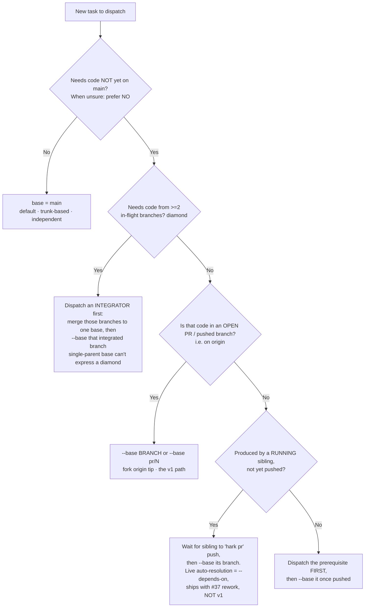
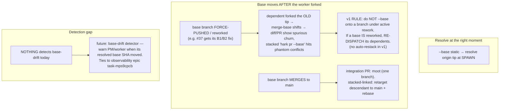
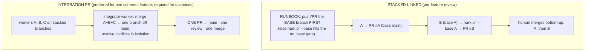

# Worker Base Selection & PR Stacking — System Design (v2)

**Status:** v2, post team-review (PM-head, 2026-05-30) · **Epic:** board `task-mps9onop`
**v2 changes:** rewritten after adversarial review (`agent-mpsad79m`) found 4 blocking flaws
in v1. The fixes: base must persist on the *agent* and thread the **read** path (not just
worktree creation); v1 centers on `--base` onto an **open PR** (not the metadata-only
`--depends-on`); diamonds route to an **integrator**; force-push/rework staleness has an
explicit rule. See §10 for the review-resolution table.

---

## 1. The problem
Workers always fork from `origin/main` (`orch.baseRef`). In a long autonomous session PRs
stack up *unmerged*. The moment a task needs files from an earlier-but-open PR, forking from
`main` strands it — stale code, or conflicts. Real case: the **#37 fix** (`task-mprrgqi8`)
must build *on* PR #37's branch; main doesn't have it.

**Ask:** make "fork from a branch / open PR" first-class and **highly visible**, with a
documented decision flow for *who* picks the base and *how*, plus a landing strategy
(linked stacked PRs, or — preferred — one integration PR).

---

## 2. What already exists (verified against code by review)
| Capability | State | Location |
|---|---|---|
| `addWorktree({ baseRef })` forks off any ref | ✅ | `worktree.ts` |
| `resolveWorktreeBase` (pure) + `resolveBaseRef` (real fetch of `origin/<branch>` tip) | ✅ | `worktree.ts:101` / `:353` |
| `hark agent spawn` parses `--base` | 🟡 parsed, **not consumed** | `cli.ts:96` vs `:269-290` |
| spawn always passes `orch.baseRef` to addWorktree | ⛔ the gap | `orchestrator.ts:187,248` |
| diff / log / status / PR-body all use `orch.baseRef` (no per-agent base) | ⛔ read-path gap (B1) | `server.ts:430,1506,1527,1574` |
| `hark orch set-base <ref>` (whole-orch) | ✅ coarse | `server.ts:1291` |
| `hark pr --base <ref>` (PR stacking target) | ✅ | `server.ts:1561` |
| `--depends-on` recorded as metadata only (forks main) | ⛔ not live | `orchestrator.ts:177` |
| lazy-branch-at-handoff (dependent forks upstream HEAD) | ⛔ metadata-only; PR #37 needs rework | branch `coder-47c99b` |
| integrator role (merge N branches → 1) | ✅ pattern | prior sessions |

**Takeaway:** per-worker base is a *small* plumbing change — but it must touch BOTH the
create path (worktree) AND the read path (diff/log/status/PR), and **persist the base on the
agent**, or every downstream view corrupts (B1).

---

## 3. The decision model — WHO and HOW (v2)

### WHO: the PM-head owns base selection.
It is the only actor with the cross-task picture (what's in flight, what's open, what each
task touches). Workers never pick their own base. The human overrides anything.

### HOW: the base-decision tree (v1-honest — only ships what exists)

**Cost asymmetry (why "prefer NO" when unsure):** a wrong *No* (forked main, later needed
the PR) usually surfaces as a conflict at review/integration — a bounded, late cost. A wrong
*Yes* permanently couples an independent change to an unmerged PR and inherits its
rework/restack churn. Over-coupling propagates failure; under-coupling is caught locally.
**Default to `main`; stack only when the need is clear.** The PM rarely knows a task's exact
files pre-dispatch (the worker discovers them), so the file-overlap heuristic
(`git diff --name-only main...<PR>` ∩ expected files) is a *hint*, not a gate.

### Mechanism, v1: `--base` only (static, onto origin)
- **`--base <branch>` / `--base pr/N`** — fork off a pushed branch / open PR. `pr/N` is
  resolved to its head branch via `gh` **before** base resolution (so `resolveBaseRef` sees
  a real branch, not a literal `pr/N`). Resolves to the `origin/<branch>` tip at **spawn**.
- **`--depends-on` (live sibling, resolve-at-handoff) is explicitly NOT v1** — it is
  metadata-only today (forks main, silently). It ships with the #37 rework
  (`task-mprrgqi8`). Until then, the live-sibling case is served by "wait for the sibling's
  `hark pr`, then `--base` its branch."

**Trap to forbid (S1):** never `--base` a *live worker's* branch that hasn't been pushed —
`baseOnOrigin` is false, so `resolveBaseRef` falls back to the local ref and forks whatever
partial, mid-task state exists, with no error. v1 rule: **`--base` targets only pushed
branches (open PRs / main).**

---

## 4. Staleness & base-drift (v2 — covers the motivating case)

- **No Graphite-grade auto-restack in v1** — short-lived workers + the integration-PR
  landing make it unnecessary. The explicit rule above (don't stack on a reworking branch;
  re-dispatch on rework) is the v1 answer; a base-drift *detector* is the future upgrade.

---

## 5. Landing strategy — linked vs integration (+ push ordering)

- **Stacked-linked** preserves granular review; needs the **push-ordering** runbook (upstream
  `hark pr` before any dependent PR, or the `baseOnOrigin` gate rejects it — S5).
- **Integration PR (USER-PREFERRED)** — one review/merge; **mandatory for diamonds** (B3).
  PM default: when ≥2 workers stack into one shippable unit, route to an integrator.

---

## 6. Visibility — loud everywhere (buildable only once base is persisted, §7)
1. **Spawn echo** (extends PR #38): when the resolved base != main, add
   `stacked on: <branch> (PR #N)`.
2. **`hark orch status`**: a **base** column; **indent** a worker under its base-owner so the
   stack reads as a tree (mirrors `worktreePath`'s org-chart grouping).
3. **`hark orch stack`** (new, follow-up): the dependency DAG with PR numbers and
   **live / merged / reworking** state per edge (not just the static edge — B4/N4).
4. **Board**: a stacked task records `base=<ref>` metadata; the relationship is keyed.

---

## 7. Implementation slices (v2)

### Slice 1 — core (this PR; the real heart is the read-path + persistence, not just spawn)
1. **Consume `--base`** in `hark agent spawn` (CLI parses it already) → into the agent-create
   request body. Resolve `pr/N` → head branch via `gh` **before** base resolution.
2. **Thread the override** into `orchestrator.spawnAgent({ baseRef })` →
   `addWorktree(baseRef = override ?? orch.baseRef)`.
3. **PERSIST the resolved base on the AGENT record** (today it's only on the orch —
   `server.ts:1441`). This is the linchpin (B1/S4).
4. **Thread the per-agent base into the READ path**: `diffBranch`, `branchGitSummary`
   (status diffstat/commit-count), and `buildPrBody` must measure against the **agent's**
   base, not `orch.baseRef`. **`hark pr` defaults `--base` to the agent's persisted base**
   (explicit `--base` still overrides). Without this the diff/PR show the ancestor's commits
   as the worker's own — the #18 base-drift bug on the read side.
5. **Guard**: reject `--base <ref>` that isn't a pushed branch / resolvable (forbid the
   partial-live-fork trap, S1).
6. **Tests**: override threading; `pr/N` resolution + sequencing; read-path measures agent
   base; `hark pr` auto-targets persisted base; stale-/unpushed-base rejection.

### Slice 2 — visibility
Spawn-echo "stacked on" line + `orch status` base column/indent (now buildable — base is
persisted).

### Slice 3 — docs
This decision flow + diagrams → `docs/` (worker-readable), incl. the **push-ordering
runbook** and the **diamond → integrator** rule.

### Slice 4 — follow-up (separate PRs, explicitly NOT this one)
`--depends-on` live base resolution = the #37 rework (`task-mprrgqi8`); integration-PR
automation; `hark orch stack` DAG view with liveness; base-drift detector;
`hark base suggest` (mechanized reasoning input).

**This PR = Slices 1–3.** Honest, self-contained, no dependency on the unmerged #37.

---

## 8. Decisions — RESOLVED (human, 2026-05-30)
1. **Default landing = INTEGRATION-PR.** When ≥2 workers form one shippable unit, the PM
   routes them to an integrator → one branch off main → ONE PR / one review / one merge. A
   lone worker still gets its own PR; diamonds always go through an integrator. The PM MAY
   choose stacked-linked for the rare genuinely-independent-but-coupled case, but it is never
   the default (it forces push-ordering + bottom-up manual merge sequencing — the fragility we
   reject). Rationale: collapses N merges→1 (matches the human's minimal merge/deploy
   friction), kills the push-ordering + merge-ordering rituals, and moves conflict resolution
   earlier into an isolated integrator worktree instead of surfacing it at human merge time.
2. **`--base pr/N` = YES.** Support PR-number resolution via `gh` in v1 (resolve `pr/N` → head
   branch before base resolution). `--base <branch>` still works. Matches what the human sees
   (PR numbers) vs the long auto-generated branch slugs.
3. **No auto-restack in v1 = CONFIRMED.** v1 rule (don't `--base` a reworking branch;
   re-dispatch dependents on rework) now; base-drift *detector* later, tied to the
   observability epic. No Graphite-grade auto-rebase in v1.

---

## 9. Self-critique & team-review status
v1 self-grill (persist-per-agent, diamonds-force-integration, churning-base) was confirmed
and *extended* by review — every self-grill point became a graded finding below, so the
process held. The read-path corruption (B1) and the decision-tree/`--depends-on`
inconsistency (B2) were the two I under-weighted; both are fixed in v2.

## 10. Review-resolution (agent-mpsad79m, CHANGES-REQUESTED → addressed)
| # | Finding | Resolution in v2 |
|---|---|---|
| B1 | base override must thread read path + persist on agent | §7 Slice 1 steps 3–4 (now the core) |
| B2 | tree routes common case to non-shipping `--depends-on` | §3 tree v2 routes to `--base`-onto-open-PR; depends-on marked #37-only |
| B3 | diamonds unrepresentable | §3 tree + §5 route diamonds to an integrator (explicit) |
| B4 | force-push/rework staleness omitted | §4 covers it: v1 rule + future base-drift detector |
| S1 | `--base` live sibling forks partial work | §3 trap rule: `--base` only pushed branches; §7.5 guard |
| S2 | cost-asymmetry / no safe default | §3 "prefer NO when unsure", documented asymmetry |
| S3 | handoff ordering barrier | deferred with `--depends-on` to #37 (Slice 4); noted there |
| S4 | persist base per agent | §7 Slice 1 step 3 (linchpin) |
| S5 | stacked-linked push ordering | §5 runbook (push base branch first) |
| N1–N4 | marker/heuristic/sequencing/echo caveats | folded into §2/§3/§7 |

*Sources for the stacked-PR model: Graphite stacked diffs, GitKraken/Tower stacked-PR docs.*
